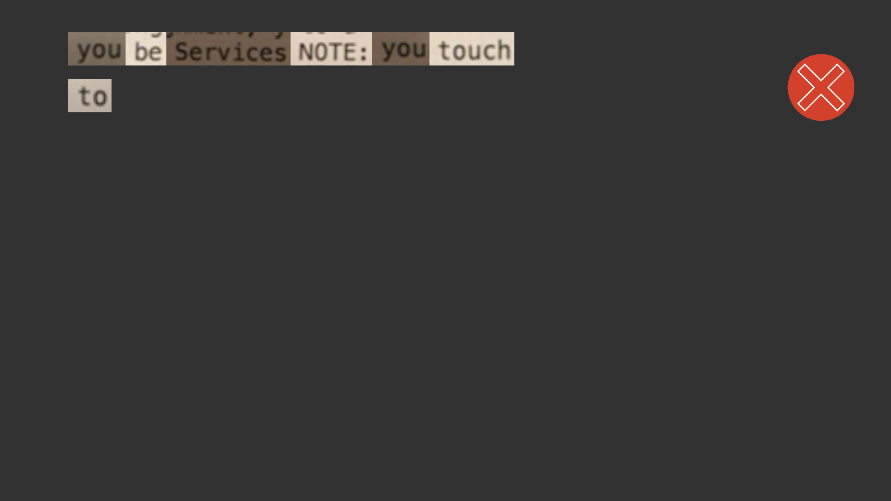
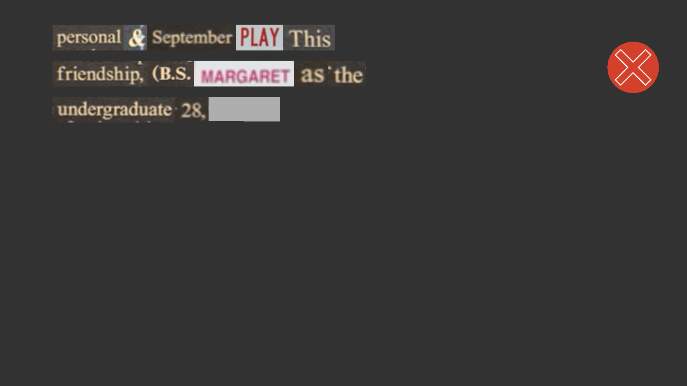
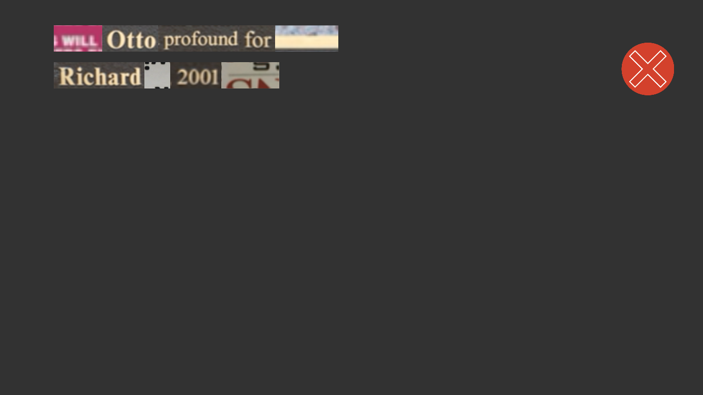
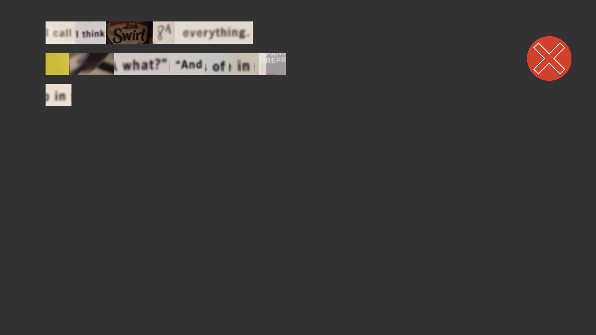
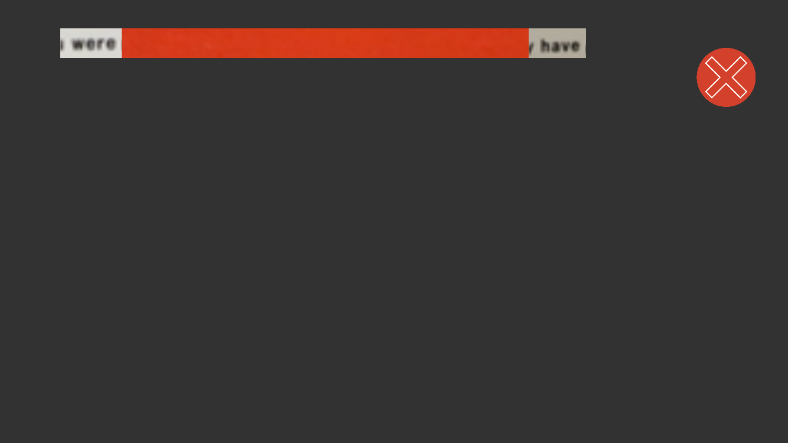

“Wordhunt” is a mobile app I am developing in Unity. It generates random poems from words gathered with the camera on your mobile phone, and shows you those poems assembled “ransom-note” style with cutouts from your camera’s pictures.

The app implements Google’s Cloud Vision to read and crop words from your photographs. The first iteration of this app had you “collecting” words to complete the poems written by famous, dead writers in a poetry API.

Now the app generates original poems, composed randomly, Dada-style. Here are a few more samples of the app’s output:

I shifted away from fulfilling the poems of others because poems unique to the user felt more rewarding after the act of collecting words. I think this decision underscores a relationship that all writing has with what’s come before it; like all poetry, even the random, generative version of this app must pull (literally) from the language already established by others to find its voice.

Acknowledgements

Thank you to Golan Levin and my classmates in the Spring of 2018 for their help in developing this project.
