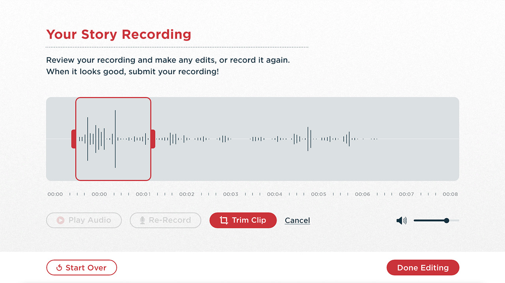
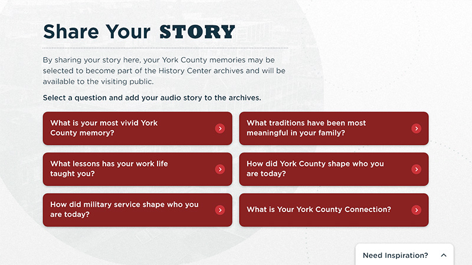
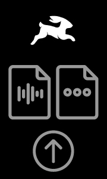
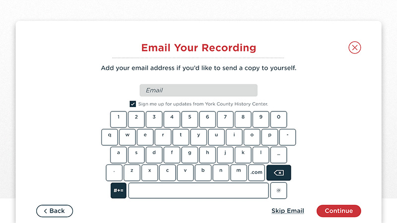

# Bespoke Audio Booth

<cover-img>

</cover-img>

<design-meta>

### WHAT

Museum Interactive

### WHEN

June 2024

### MY ROLE

Developed Visitor-Ready Software

### TOOLS

Unity\
ffmpeg

</design-meta>

<grid-container>

# OVERVIEW

## Visitors share their stories

In a bespoke audio booth, visitors record their voice in response to prompts about York County's history.

<touch-container title="The first page of the experience, which welcomes visitors with a set of text prompts for their recording to choose from, as well as set of two example oral histories to preview before creating their own recording.">

</touch-container>

# VISITOR EXPERIENCE

## A short, personal story about York County

Visitors introduce themselves to the archive and record their voice.

<touch-container title="Recording page, with recording underway">
<video-container>

`vimeo: https://vimeo.com/1019521047`

</video-container>
</touch-container>

After, visitors edit their recordings with a custom editor.

<touch-container title="Editing page">
<video-container>

`vimeo: https://vimeo.com/1019521855`

</video-container>
</touch-container>

Finally, visitors share their recordings with the museum and optionally include their names and emails.

# MOTION DESIGN

I designed and developed the motion design for this interactive, including interactions around pagination, on-screen microphone controls, and editing controls.

<touch-container title="Transition between prompt and recording pages">
<video-container>

`vimeo: https://vimeo.com/1019522613`

</video-container>
</touch-container>

# TECHNICAL HIGHLIGHTS

## Directus communication for storing visitor audio

The interactive sends visitor-produced audio and metadata to a custom endpoint in a CMS, built with [Directus](https://directus.io/) and hosted on the local network.

<touch-container title="Email entry page, which visitors use to optionally share their email with the museum and/or receive a copy of their audio">

</touch-container>

On startup, the interactive also pulls its set of visitor text prompts from this CMS.

<touch-container title="The first page of the experience with six text prompts, which are sourced dynamically from a local CMS that museum staff can access and change on the fly.">

</touch-container>

</grid-container>